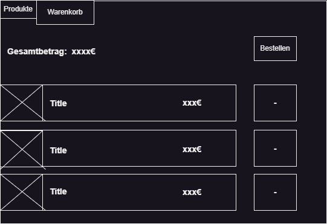

# Projekt: Einkaufswagen Anwendung (4FunBike)

Ein Einkaufswagen-Programm, das Produkte in Listenform darstellt und es dem Benutzer ermöglicht, Produkte zum Warenkorb hinzuzufügen. Dieses Projekt nutzt C# mit Windows Forms zur Darstellung der Benutzeroberfläche.

## Details:

- **Dauer:** 2 * 90min
- **Bibliothek:** JSON Reader/Writer
- **Ausgabe:** Rechnung
- **Datenspeicherung:** Als JSON-Datei
- **IDE:** Visual Studio & VS Code
- **Programmiersprache:** C# mit Windows Forms

## Features:

- Einlesen der daten Datei durch einen FileChooser
- Ein großes Quadrat, welches Produkte in Listenform darstellt. Jedes Produkt verfügt über ein Bild, Namen, Preis und einen "Hinzufügen"-Button.
- Ein Warenkorb-Tab oben in der Anwendung. 
- Unter dem Warenkorb-Tab kann der Kunde alle hinzugefügten Produkte sowie die Gesamtkosten einsehen
- Desweiteren können im Warenkorb Produkte wieder entfernt werde, wobei der Gesamtpreis sich automatisch anpasst.
- Die Option "hier klicken zum Bestellen" ermöglicht es dem Kunden, den Kauf abzuschließen und seinen Warenkorb zu leeren.

## Ein/Ausgabefelder:

Um einen genauen Überblick über die Ein- und Ausgabefelder zu erhalten, siehe untenstehende Bilder:

Test für einen Commit

